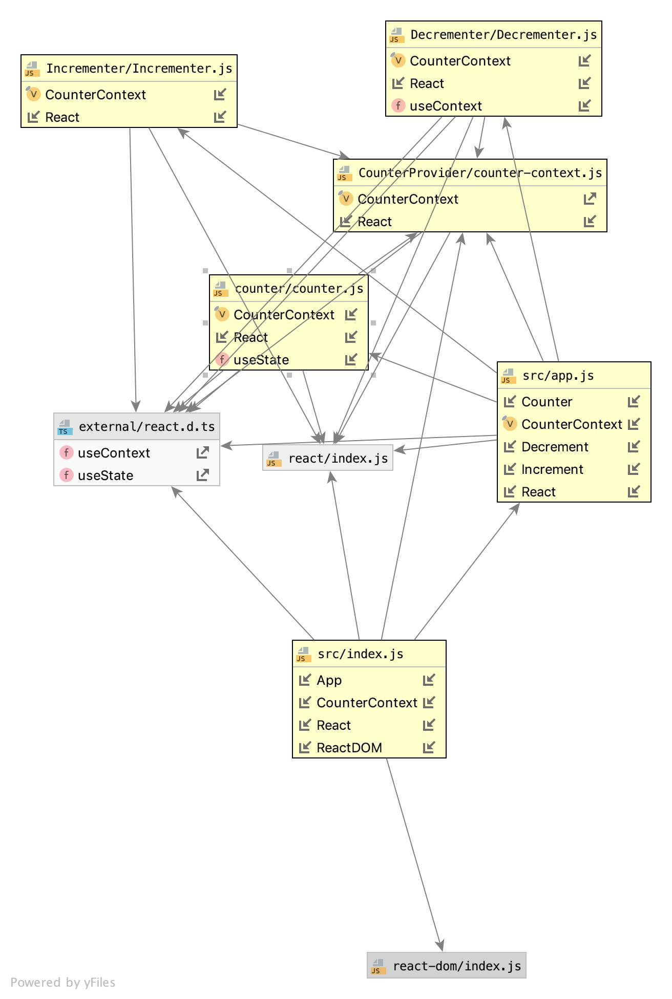

# LAB - 33

## Context

### Author: Jessica Walters

### Links and Resources
* [submission PR](https://github.com/401-advanced-javascript-jessica/401-lab-33/pull/2)
* [travis](https://www.travis-ci.com/401-advanced-javascript-jessica/401-lab-33)
* [Amplify](https://master.dc9z2ummimaqu.amplifyapp.com/)

#### Documentation
* [styleguide](localhost:6060)

### Components
#### `counter.js`
#### `Decrementer.js`
#### `Incrementer.js`
#### `counter-context.js`

### Setup

#### Running the app
* `npm run start`
  
#### Tests
* `npm run test`

#### UML

